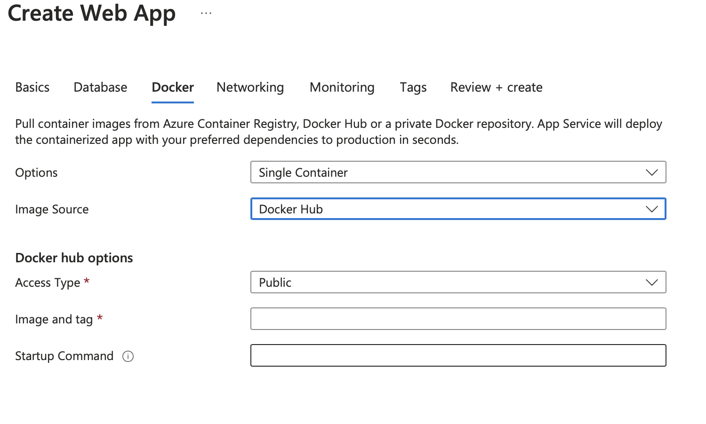

# Individual Project 4 for Data Engineering Systems: Deploying an Azure App using a docker image stored on Dockerhub

The purpose of this individual project is to show that you can deploy a public-facing app using Azure and DockerHub.

I will build a publicly accessible auto-scaling container, enable the flask app to run in a docker container, host the container in dockerhub, and deploy the container as a web app. Additionally, I will make sure that CI/CD is implemented to ensure that the app users will always see the latest build of the app.

Ultimately, the app that I will use to show these steps is a book recommendation system. It takes 4 datasets, gathered from goodreads using the goodreads API, performs ETL processes, and finally, performs analysis to determine which books to recommend and how many based on user interaction with the app.

While the backend of how the app works is important and interesting, I will spare the details to focus on how the deploying process occurs. 

# Deploying the Web App Process
## DockerHub Set-Up
* First, we need to sign into DockerHub. This is the external cloud-based image storing system. DockerHub stores docker images in repositories. This is a similar process to github, but for docker images. We will also need to create a repository for this web app project.

As you can see here, I have logged into DockerHub and created a repository named bookbuddy-lg.

* Next, we need to sign into DockerHub from the command line within codespaces (or the terminal where you have cloned this repository). To do this, you submit the following command:
  `docker login -u <username>`
  Where username is your dockerHub username. You will be prompted to enter you password.

# Pushing Docker Image to DockerHub
* Next, we need to create the docker image that the app will be based off of. To do this (after confirming the code is up and running, tested, and finalized), run the following command:
  `docker build -t <username>\<repository> .`
  This will build the docker image naming it the username\repository combination. Remember to end the command with a space and period. The following is an example of what to expect when building a docker image.

* Now that we have a built docker image, the next step is to get the docker image to DockerHub. This allows for it to be publicly stored and available for azure to pull from. To do this, run the following command:
`docker push <username>/<repository>:<tagname>`

Tagname is typicaly 'latest'. This command can also be found on DockerHub once you enter the repository.

Once this step is completed, the docker image is publicly available on DockerHub and stored there.

# Creating the web app on Azure

* Azure allows for web apps to be created as a resource. Click make webapp, enter resource group, web app name, and other important information. Below is an example of the inputs needed. Confirm docker container is selected under the heading 'publish'.

Additionaly, to make the app, you need to go to the docker tab, and enter the image and tag name for the dockerHub repository created earlier.

* Click review and create, and wait for your app to be successfully deployed. Once this occurs, we need to confirm the configurations including websites_port and CI/CD enabled = true.
* Once that is saved, we are provided a link from Azure that is now our successfully created web app.

Here are some examples of what the deployment screen looks like through the deployment process.

We need to confirm configurations and the information in the deployment center:

Here are some images of the deployed app - note the domain includes the name of the web app.

